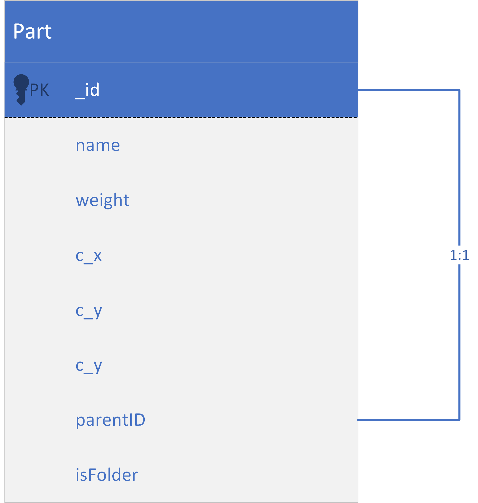

# 重量管理系统

本系统希望实现整车零件的质量管理与版本管理，能够复用标准件、设置对称件；追踪不同版本、不同赛季的质量变化；为整车的动力学仿真以及设计轻量化总体目标提供参考依据。在以后的功能中，或许能够增加文件管理系统，使得车队整体的管理流程电子化、规范化。

同时本项目是我个人学习前后端开发的第一个项目，必然存在诸多设计上的不足以及技术上的缺陷。

## 系统架构与开发计划

1. 最先希望实现的功能即“系统-部件-零件”的逻辑关系，保证每个系统能够被方便地编辑。
    - 借用了UG的思路，现在分为“文件夹”和“零件”两种：文件夹本身没有重量，重量自动计算；零件才能定义重量

2. 让通用件（标准件）可以在多处使用，建立相对独立地引用机制。同时对称地部件可以自动生成（主要是悬架系统）

3. 建立项目的概念，让不同赛季的车可以进行升级对比

4. 增加附件，从重量管理升级为更加综合的辅助工具。能够到处excel格式的物料清单，并自动导出一些图片辅助制作报告。