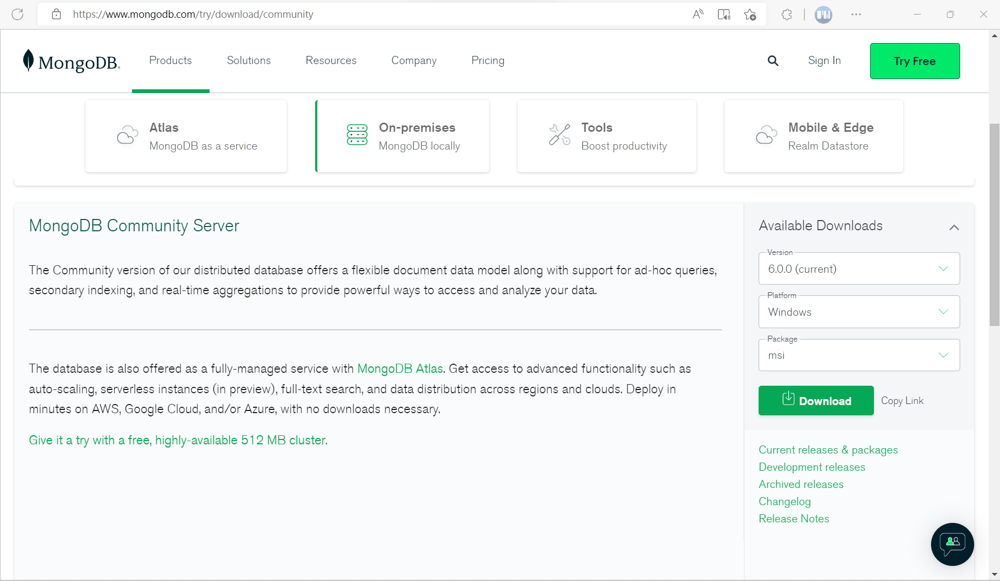
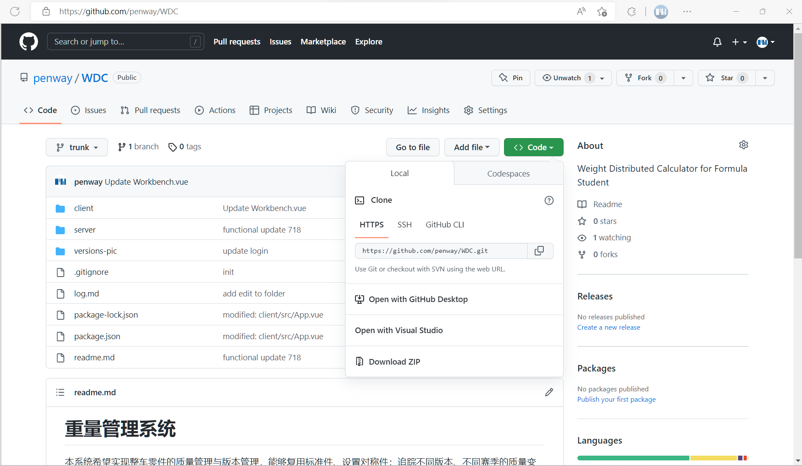
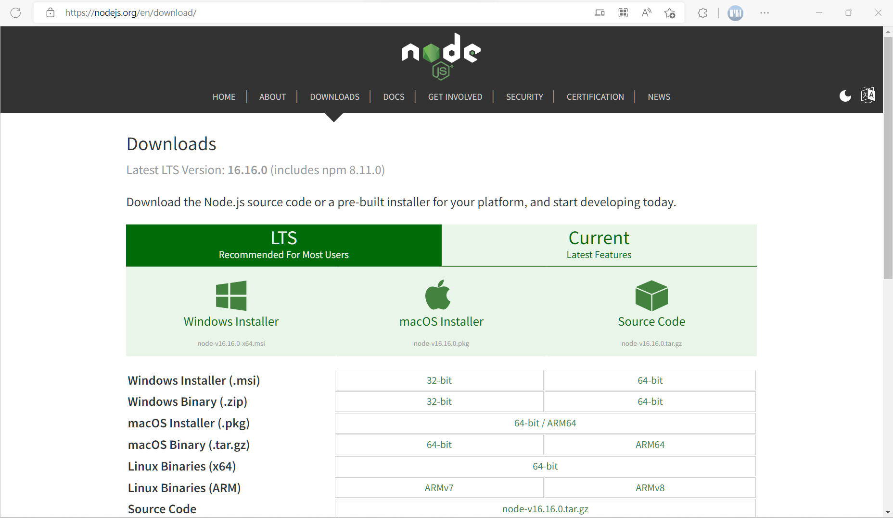

# FSAE 重量管理系统

本系统希望实现整车零件的质量管理与版本管理功能，能够复用标准件、设置对称件；追踪不同版本、不同赛季的质量变化；为整车的动力学仿真以及设计轻量化总体目标提供参考依据。在未来的版本中，或增加文件管理系统，使得车队整体的管理流程电子化、规范化。

本项目是我个人学习前后端开发的首个项目，难免存在一些设计上的不足以及技术上的缺陷，希望能有更多朋友加入开发，一起完善本项目。

## 系统架构与开发计划

1. 最先希望实现的功能即“系统-部件-零件”的逻辑关系，保证每个系统能够被方便地编辑。
    - 借用了UG的思路，现在分为“文件夹”和“零件”两种：文件夹本身没有重量，重量自动计算；零件才能定义重量

2. 让通用件（标准件）可以在多处使用，建立相对独立地引用机制。同时对称地部件可以自动生成（主要是悬架系统）

3. 建立项目的概念，让不同赛季的车可以进行升级对比

4. 增加附件，从重量管理工具升级为更加综合的辅助工具。能够导出 Excel 格式的物料清单，并自动导出一些图片辅助报告制作。

## 安装指南

本项目依赖于 MVNE stack，即 MongoDB、 Express.js、 VueJS、 Node.js。因此需要安装 node.js 与 MongoDB。
下面的安装方法适用于 Windows，若您会使用 Linux，相信安装起来不成问题。

本项目目前仅可以从源码部署，以下为部署方法。

### 环境准备

1. 首先下载 [MongoDB 的 Windows 安装包](https://www.mongodb.com/try/download/community)，此处使用的是 6.0.0 版本。正常安装即可，注意运行的端口号，此处使用的是默认的 27017。

    

2. 接下来使用git或直接下载源码。`Code > Download ZIP` 如图，然后解压即可。
    

3. 最后下载 [Node.js](https://nodejs.org/en/download/)，注意下载的版本为 16 即可。
    

### 安装 Node.js 环境

1. 启动命令行窗口，可以使用 Windows Terminal 打开，也可以直接启动 Powershell。
2. 输入 `node --version` 检查 node.js 是否安装完成，若显示版本信息则表明安装成功。
3. 进入 WDC 文件夹。
    示例：`cd "E:\Caldron\WDC\"`
4. 进入 client 并执行 npm install
    `cd client && npm install`
5. 进入 server 并执行 npm install
    `cd ..\server && npm install`

### 运行

在 server 文件夹中，执行 `npm run dev` 观察输出结果，若无报错即可在浏览器中打开 <http://localhost:8080>。
